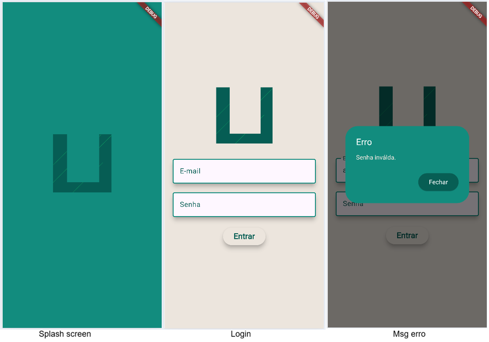

# Carrinho de compras
Exemplo de um carrinho de compras com flutter

|Funcionalidades|Recursos|
|-|-|
|Navegação entre telas|Navigator.push()<br>Navigator.pop()|
|Imagens da web|Image.asset()<br>Image.network()|
|Consumir dados de api|http.get(), http: ^1.1.0|
|Loal storage, compartihar dados entre telas|shared_preferences: ^2.2.2|
|Converter dados em lista dinamica|json.decode(dados)|
|Criar grid de Containers|GridView.builder()|
|Criar Listas|ListView.builder()|
|Verificar a orientação do celular, vertical ou horizontal|MediaQuery.of(context).orientation|
|Filtrar dados|Lógica, listas|

## Tecnologias
- Flutter
- VsCode
- Android Studio

## Passos para executar
- Clone este repositório
- Abra com VsCode ou Android Studio
- Em um terminal execute os comandos a seguir para instalar as dependências e executar:
```bash
flutter pub get
flutter run
```
- Escolha navegador ou emulador do Android Studio para testar

## Screenshots



## Outras informações
Comando para gerar o .apk para instalar no celr com Android e testar
```bash
flutter build apk --release
```
- As imagens .network geralmente não aparecem quando instalamos o .apk no dispositivo, para corrigir temos que adicionar a permição no arquivo **AndroidManifest.xml** que fica localizado em android/app/src/main antes de gerar o .apk
```xml
<uses-permission android:name="android.permission.INTERNET"/>
```
- Neste repositório existe um arquivo **[app-release.apk](./app-release.apk)** na pasta assets caso queira testar em seu celular Android, basta fazer download e instalar.

## Atividade
- Clone e execute este App no seu PC
- Estude os codigos em lib e pubspec.yaml
- Crie uma lista tipo json tipo mockup com produtos e usuários
- Coloque esta lista em um repositório público gitub
- Crie um App de carrinho de compras, com splash, login e carrinho como este porém personalizado com sua lista
- Ao conluir gere o APK, instale e teste em um celular com Anroid